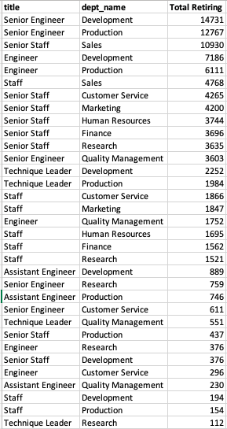
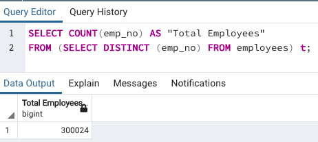

# Pewlett-Hackard Analysis

## Background

Because of the number of people leaving each department, the boss has requested three lists that are more specific:

* Employee Information: A list of employees containing their unique employee number, their last name, first name, gender, and salary
* Management: A list of managers for each department, including the department number, name, and the manager's employee number, last name, first name, and the starting and ending employment dates
* Department Retirees: An updated current_emp list that includes everything it currently has, but also the employee's departments

## Overview of Project
### Purpose
After executing the code and checking the results, a few folks are are appearing twice. Maybe they moved departments?

Bobby would like to know the following:
1. What's going on with the salaries?
2. Why are there only five active managers for nine departments?
3. Why are some employees appearing twice?

The department head for Sales was a little surprised at how many folks will be leaving, so has asked for an additional list, containing only employees in their department. The new list Bobby will need to make will contain everything in the retirement_info table, only tailored for the Sales team.

The same manager asking for a list of retiring employees has asked for a list of employees in both the Sales and Development departments because, together, both managers want to try a new mentoring program for employees getting ready to retire. Instead of having a large chunk of their workforce retiring, they want to introduce a mentoring program: experienced and successful employees stepping back into a part-time role instead of retiring completely. Their new role in the company would be as a mentor to the newly hired folks. Before they can present their idea to the CEO, they'd like to have an idea of how many people between the departments they would need to pitch their idea to.


## Analysis And Challenges

## Methodology: Analytics Paradigm

#### 1. Decomposing the Ask
Determine the number of retiring employees per title, and identify employees who are eligible to participate in a mentorship program. Then, I will write a report that summarizes my analysis and helps prepare Bobby’s manager for the “silver tsunami” as many current employees reach retirement age.


#### 2. Identify the Datasource
* employees.csv
* dept_manager.csv
* dept_emp.csv
* salaries.csv
* titles.csv
* departments.csv

#### 3. Define Strategy & Metrics
**Resource:** Postgres 11, pgAdmin, SQL

1. create ERD based on the 6 csv data above
1. create database schema
1. import csv into the database tables
1. use the tables to find out who are retiring soon, which department have the highest future retirees
1. from the future retirees information, propose a mentorship

#### 4. Data Retrieval Plan
Import csv data into the database tables using pgAdmin import function.


#### 5. Assemble & Clean the Data

* No data cleaning required
* Retiring: use SQL Select statements to gather more information on the retirees by their birthdate with the assumption that they will retire once they reach age 65 and more.
```
SELECT ...
FROM ...
WHERE (e.birth_date BETWEEN '1952-01-01' AND '1955-12-31')
```
* Mentorship Eligibility: use SQL Select statements to gather more information on the future retirees by their birthdate with the assumption that they will _**retire in 10 years.**_ These will be candidates for mentorship.
```
SELECT ...
FROM ...
WHERE (e.birth_date BETWEEN '1965-01-01' AND '1965-12-31')
```

#### 6. Analyse for Trends

Results from data filter above will give us more in-depth information regarding the different departments, roles and future retirees.

#### 7. Acknowledging Limitations
* pgAdmin is an old application for Postgres front end GUI. So sometimes when closing the application, the database will be corrupted and wiped out by pgAdmin. Do a full backup before closing.

#### 8. Making the Call:
The "Proper" Conclusion is indicated below on [Summary](#summary)

## Analysis

From our analysis, there are more than _**90,000 employees retiring soon**_; within the next year as they are already reaching age 65 and above. We determined this by counting the number of employees in unique_titles table.
```
SELECT count(emp_no) FROM unique_titles;
```

From this 90,000 retiring employees, the highest retiring positions are:
* Senior Engineer: more than 29,000
* Senior Staff: more than 28,000
* Engineer: more than 14,000
* Staff: more than 12,000

While we know there are _**almost 60,000 Senior Engineers and Senior Staffs retiring soon**_, we are not able to tell which department they belong to. Therefore using the code below, we are able to determine which departments and roles have the highest retiring employees

```
SELECT ut.title, d.dept_name, count(ut.emp_no) AS "Total Retiring"
INTO dept_titles_retiring
FROM unique_titles AS ut
JOIN dept_emp AS de
ON (ut.emp_no = de.emp_no)
JOIN departments AS d
ON (de.dept_no = d.dept_no)
GROUP BY d.dept_name, ut.title
ORDER BY count(ut.emp_no) DESC;
```
The table above is a snapshot of retiring employees where we can see the retiring Senior Engineers, Senior Staffs, Engineers and Staffs span across all departments of the organisation and not just Development and Sales. The most impacted departments with more than 10,000 retiring soon are Development, Production and Sales departments.


>Department & Titles Retiring




Current total employees in Pewlett Hackard: _**300,000**_. See image below.

>Total Employees




When we search for employees who maybe retiring in 10 years for the mentorship programme, there are only _** around 1900 employees**_ eligible.


## Summary

Summary: Provide high-level responses to the following questions, then provide two additional queries or tables that may provide more insight into the upcoming "silver tsunami."
How many roles will need to be filled as the "silver tsunami" begins to make an impact?
Are there enough qualified, retirement-ready employees in the departments to mentor the next generation of Pewlett Hackard employees?

From the above analysis, this "silver tsunami" will have _**90,000 employees retiring soon**_ with


From the analysis above, the most significant differences are due to Thomas High Schools' academic dishonesty are:

1. Thomas High School overall scores fell from _**90.94% to 65.07%**_. This means _**25.9%**_ discrepancy.
1. Thomas High School math scores fell from _**93.27%% to 66.91%**_. This means _**26.36%**_ discrepancy.
1. Thomas High School reading scores fell from _**97.3% to 69.66%**_. This means _**27.64%**_ discrepancy.


## Appendix
